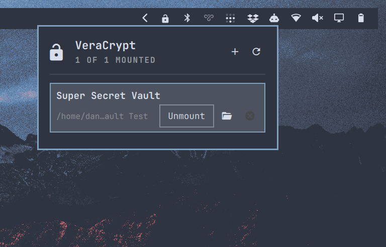

# VeraCrypt Vaults for Omarchy

Mount and unmount your VeraCrypt containers straight from the Omarchy bar, instead of opening the VeraCrypt GUI and clicking through it every time.



It's an Omarchy Quattro bar-widget plugin with a dropdown panel and a small CLI wrapper. The plugin never stores or handles your passphrases. Mounting hands off to VeraCrypt itself, so VeraCrypt does the credential prompt.

## Install

```bash
omarchy plugin add https://github.com/dannymcc/omarchy-veracrypt.git --enable
omarchy restart shell
```

The shell hot-reloads plugin code on save, but a widget added while it is
running can end up with a component load that never finishes, and the shell
skips a widget whose load is still in flight. If the lock icon does not show
up on the bar, `omarchy restart shell` clears it.

For local development:

```bash
mkdir -p ~/.config/omarchy/plugins
cp -r "$PWD" ~/.config/omarchy/plugins/io.github.dannymcc.veracrypt-vaults
omarchy-shell shell rescanPlugins
omarchy plugin enable io.github.dannymcc.veracrypt-vaults
omarchy restart shell
```

## Add your vaults

Open the dropdown and use **Add vault**. On a machine with nothing configured
yet the form is already open, since it is the only useful thing the panel has
to offer.

Each vault needs a name, a container file and a directory to mount it on. The
two path fields have a built-in picker:

- The file picker shows directories plus anything that looks like a container
  (`.hc`, `.tc`, `.vc`, `.veracrypt`, `.truecrypt`), marked with a padlock.
  Containers carry no magic bytes — the header is encrypted — so the extension
  is the only hint there is. **Show all files** lifts the filter when your
  container is named something else.
- The directory picker can make the mount directory for you with **New folder
  here**, because a mount point usually does not exist yet.

The picker is built into the panel rather than being a GTK file dialog: the
Omarchy panel dismisses on any click outside it, so an external chooser takes
the panel down with it before it can hand a path back.

Both fields stay editable, so you can paste a path instead. Pressing Enter on
an empty path field opens its picker; arrow keys and Enter drive it.

The `✕` on a row removes that vault from the config. It never touches the
container itself, and it refuses while the vault is mounted.

### Or edit the file

The config is a tab-separated file at `~/.config/omarchy/veracrypt-vaults.tsv`:

```text
name<TAB>container_path<TAB>mount_directory
```

Blank lines and lines starting with `#` are ignored. There's a
`config.example.tsv` in the repo to copy from.

## Use

The plugin appears as a padlock on the Omarchy bar — closed while everything is
locked, open once at least one vault is mounted. The tooltip carries the count.
Click it to open the dropdown. Each configured vault shows:

- mount status
- container path, or mount path once mounted
- `Mount` / `Unmount`
- `Open`, when mounted
- `✕` to drop it from the config

**Unmount all** appears once more than one vault is mounted. It only closes
the vaults in your config, never volumes mounted outside the plugin. The CLI
has a matching `mount-all`.

### Passphrases

Where the passphrase prompt appears depends on which VeraCrypt you have:

- The GUI build asks in its own window.
- `veracrypt-console-bin` has no GUI and asks on a terminal, so the plugin
  opens a floating Omarchy terminal for the mount. sudo asks for its password
  in the same window.

Either way the passphrase goes straight to VeraCrypt. The plugin never sees it.

The dropdown also answers to IPC, so you can bind it to a key or drive it from
a script:

```bash
omarchy-shell io.github.dannymcc.veracrypt-vaults toggle
omarchy-shell io.github.dannymcc.veracrypt-vaults refresh
omarchy-shell io.github.dannymcc.veracrypt-vaults status   # "2/3", or "Vaults"
```

You can also drive the wrapper directly:

```bash
scripts/veracrypt-vaults list              # list configured vaults
scripts/veracrypt-vaults status            # mount status for all vaults
scripts/veracrypt-vaults mount Personal
scripts/veracrypt-vaults unmount Personal
scripts/veracrypt-vaults mount-all
scripts/veracrypt-vaults unmount-all
scripts/veracrypt-vaults open Personal
scripts/veracrypt-vaults add Personal ~/vaults/personal.hc ~/Vaults/Personal
scripts/veracrypt-vaults remove Personal
scripts/veracrypt-vaults config            # where the config file lives
```

To prompt for the passphrase in the terminal rather than the VeraCrypt GUI:

```bash
VERACRYPT_VAULTS_TEXT=1 scripts/veracrypt-vaults mount Personal
```

## Dependencies

- Omarchy 4 / Quattro shell
- VeraCrypt CLI on `PATH`
- `findmnt`
- `xdg-open` for the `Open` action

On Arch and Omarchy, VeraCrypt comes from the Arch repositories or the AUR, depending on how your package sources are set up.

## Security notes

Omarchy plugins run unsandboxed inside the long-lived Omarchy shell process. Read this plugin before you enable it.

By design, it does not:

- store VeraCrypt passwords
- pass passphrases on the command line
- add systemd units
- ship privilege-elevation helpers
- install packages for you

Mounting still gives VeraCrypt access to the configured container and mount directory, and a compromised user session can reach anything the user can reach. The plugin narrows the attack surface, it doesn't remove it.

## Validate

On an Omarchy machine:

```bash
omarchy plugin validate .
```

The CLI works without Omarchy, so you can smoke-test it against the example config:

```bash
VERACRYPT_VAULTS_CONFIG=./config.example.tsv scripts/veracrypt-vaults list
```

## Remove

```bash
omarchy plugin disable io.github.dannymcc.veracrypt-vaults
omarchy plugin remove io.github.dannymcc.veracrypt-vaults
```

Delete the config yourself if you're done with it:

```bash
rm ~/.config/omarchy/veracrypt-vaults.tsv
```
